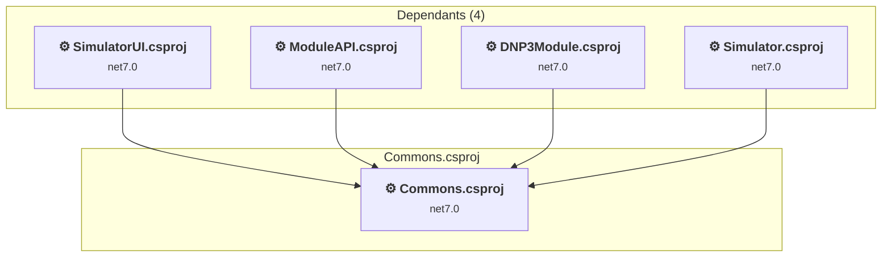

# Simulator\Commons\Commons.csproj

[← Back to the assessment index](../../assessment.md)

## Project Info

- **Current Target Framework:** net7.0
- **Proposed Target Framework:** net8.0
- **SDK-style**: False
- **Project Kind:** ClassicClassLibrary
- **Dependencies**: 0
- **Dependants**: 4
- **Number of Files**: 6
- **Number of Files with Incidents**: 1
- **Lines of Code**: 298
- **Estimated LOC to modify**: 0+ (at least 0,0% of the project)

## Related Projects

**Depended on by (4)** — projects that reference this one:

- [D:\DNP3\dnp3-simulator\Simulator\DNP3\DNP3Simulator\DNP3Module.csproj](../projects/DNP3Module.md)
- [D:\DNP3\dnp3-simulator\Simulator\SimulatorAPI\ModuleAPI.csproj](../projects/ModuleAPI.md)
- [D:\DNP3\dnp3-simulator\Simulator\SimulatorUI\SimulatorUI.csproj](../projects/SimulatorUI.md)
- [D:\DNP3\dnp3-simulator\Simulator\Simulator\Simulator.csproj](../projects/Simulator.md)

## Dependency Graph

Legend:
📦 SDK-style project
⚙️ Classic project

## API Compatibility

| Category | Count | Impact |
| :--- | :---: | :--- |
| 🔴 Binary Incompatible | 0 | High - Require code changes |
| 🟡 Source Incompatible | 0 | Medium - Needs re-compilation and potential conflicting API error fixing |
| 🔵 Behavioral change | 0 | Low - Behavioral changes that may require testing at runtime |
| ✅ Compatible | 303 |  |
| ***Total APIs Analyzed*** | ***303*** |  |

## NuGet Package Issues

| Package | Current Version | Suggested Version | Severity | Issue |
| :--- | :---: | :---: | :---: | :--- |
| opendnp3 | 2.2.0-M1 | 3.1.2 | 🔴 Mandatory | Pakiet NuGet jest niezgodny |

Every project affected by these packages, and the versions the repository settles on: [aggregate NuGet packages](../nuget/aggregate-packages.md).

## Binding Redirect Configuration

| Rule | Severity | Details | Recommendation |
| :--- | :---: | :--- | :--- |
| AutoGenerateBindingRedirects not set and no manual redirects | 🟡 Potential | AutoGenerateBindingRedirects is not set in Commons.csproj, no manual redirects found | Explicitly enable <AutoGenerateBindingRedirects>true</AutoGenerateBindingRedirects> or add manual binding redirects. |

