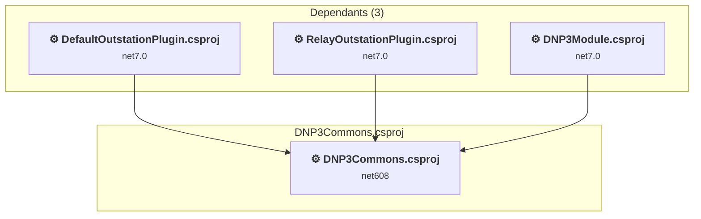

# simulator\DNP3\DNP3Commons\DNP3Commons.csproj

[← Back to the assessment index](../../assessment.md)

## Project Info

- **Current Target Framework:** net608
- **Proposed Target Framework:** net8.0-windows
- **SDK-style**: False
- **Project Kind:** ClassicWinForms
- **Dependencies**: 0
- **Dependants**: 3
- **Number of Files**: 21
- **Number of Files with Incidents**: 8
- **Lines of Code**: 1749
- **Estimated LOC to modify**: 192+ (at least 11,0% of the project)

## Related Projects

**Depended on by (3)** — projects that reference this one:

- [D:\DNP3\dnp3-simulator\Simulator\DNP3\DefaultOutstationPlugin\DefaultOutstationPlugin.csproj](../projects/DefaultOutstationPlugin.md)
- [D:\DNP3\dnp3-simulator\Simulator\DNP3\DNP3Simulator\DNP3Module.csproj](../projects/DNP3Module.md)
- [D:\DNP3\dnp3-simulator\Simulator\DNP3\RelayOutstationPlugin\RelayOutstationPlugin.csproj](../projects/RelayOutstationPlugin.md)

## Dependency Graph

Legend:
📦 SDK-style project
⚙️ Classic project

## API Compatibility

| Category | Count | Impact |
| :--- | :---: | :--- |
| 🔴 Binary Incompatible | 192 | High - Require code changes |
| 🟡 Source Incompatible | 0 | Medium - Needs re-compilation and potential conflicting API error fixing |
| 🔵 Behavioral change | 0 | Low - Behavioral changes that may require testing at runtime |
| ✅ Compatible | 793 |  |
| ***Total APIs Analyzed*** | ***985*** |  |

## NuGet Package Issues

| Package | Current Version | Suggested Version | Severity | Issue |
| :--- | :---: | :---: | :---: | :--- |
| opendnp3 | 2.2.0-M1 | 3.1.2 | 🔴 Mandatory | Pakiet NuGet jest niezgodny |

Every project affected by these packages, and the versions the repository settles on: [aggregate NuGet packages](../nuget/aggregate-packages.md).

## Project Technologies and Features

| Technology | Issues | Percentage | Migration Path |
| :--- | :---: | :---: | :--- |
| Windows Forms | 192 | 100,0% | Windows Forms APIs for building Windows desktop applications with traditional Forms-based UI that are available in .NET on Windows. Enable Windows Desktop support: Option 1 (Recommended): Target net9.0-windows; Option 2: Add <UseWindowsDesktop>true</UseWindowsDesktop>; Option 3 (Legacy): Use Microsoft.NET.Sdk.WindowsDesktop SDK. |

