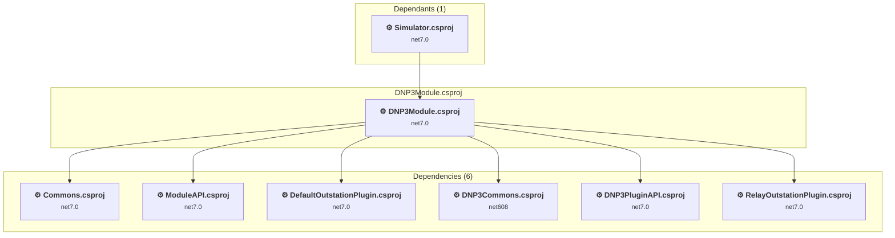

# Simulator\DNP3\DNP3Simulator\DNP3Module.csproj

[← Back to the assessment index](../../assessment.md)

## Project Info

- **Current Target Framework:** net7.0
- **Proposed Target Framework:** net8.0-windows
- **SDK-style**: False
- **Project Kind:** ClassicWinForms
- **Dependencies**: 6
- **Dependants**: 1
- **Number of Files**: 76
- **Number of Files with Incidents**: 47
- **Lines of Code**: 7319
- **Estimated LOC to modify**: 7194+ (at least 98,3% of the project)

## Related Projects

**Depends on (6)** — projects this one references:

- [D:\DNP3\dnp3-simulator\Simulator\Commons\Commons.csproj](../projects/Commons.md)
- [D:\DNP3\dnp3-simulator\Simulator\DNP3\DefaultOutstationPlugin\DefaultOutstationPlugin.csproj](../projects/DefaultOutstationPlugin.md)
- [D:\DNP3\dnp3-simulator\Simulator\DNP3\DNP3Commons\DNP3Commons.csproj](../projects/DNP3Commons.md)
- [D:\DNP3\dnp3-simulator\Simulator\DNP3\DNP3PluginAPI\DNP3PluginAPI.csproj](../projects/DNP3PluginAPI.md)
- [D:\DNP3\dnp3-simulator\Simulator\DNP3\RelayOutstationPlugin\RelayOutstationPlugin.csproj](../projects/RelayOutstationPlugin.md)
- [D:\DNP3\dnp3-simulator\Simulator\SimulatorAPI\ModuleAPI.csproj](../projects/ModuleAPI.md)

**Depended on by (1)** — projects that reference this one:

- [D:\DNP3\dnp3-simulator\Simulator\Simulator\Simulator.csproj](../projects/Simulator.md)

## Dependency Graph

Legend:
📦 SDK-style project
⚙️ Classic project

## API Compatibility

| Category | Count | Impact |
| :--- | :---: | :--- |
| 🔴 Binary Incompatible | 7054 | High - Require code changes |
| 🟡 Source Incompatible | 140 | Medium - Needs re-compilation and potential conflicting API error fixing |
| 🔵 Behavioral change | 0 | Low - Behavioral changes that may require testing at runtime |
| ✅ Compatible | 9045 |  |
| ***Total APIs Analyzed*** | ***16239*** |  |

## NuGet Package Issues

| Package | Current Version | Suggested Version | Severity | Issue |
| :--- | :---: | :---: | :---: | :--- |
| opendnp3 | 2.2.0-M1 | 3.1.2 | 🔴 Mandatory | Pakiet NuGet jest niezgodny |

Every project affected by these packages, and the versions the repository settles on: [aggregate NuGet packages](../nuget/aggregate-packages.md).

## Binding Redirect Configuration

| Rule | Severity | Details | Recommendation |
| :--- | :---: | :--- | :--- |
| AutoGenerateBindingRedirects not set and no manual redirects | 🟡 Potential | AutoGenerateBindingRedirects is not set in DNP3Module.csproj, no manual redirects found | Explicitly enable <AutoGenerateBindingRedirects>true</AutoGenerateBindingRedirects> or add manual binding redirects. |

## Project Technologies and Features

| Technology | Issues | Percentage | Migration Path |
| :--- | :---: | :---: | :--- |
| GDI+ / System.Drawing | 136 | 1,9% | System.Drawing APIs for 2D graphics, imaging, and printing that are available via NuGet package System.Drawing.Common. Note: Not recommended for server scenarios due to Windows dependencies; consider cross-platform alternatives like SkiaSharp or ImageSharp for new code. |
| Windows Forms | 7054 | 98,1% | Windows Forms APIs for building Windows desktop applications with traditional Forms-based UI that are available in .NET on Windows. Enable Windows Desktop support: Option 1 (Recommended): Target net9.0-windows; Option 2: Add <UseWindowsDesktop>true</UseWindowsDesktop>; Option 3 (Legacy): Use Microsoft.NET.Sdk.WindowsDesktop SDK. |

